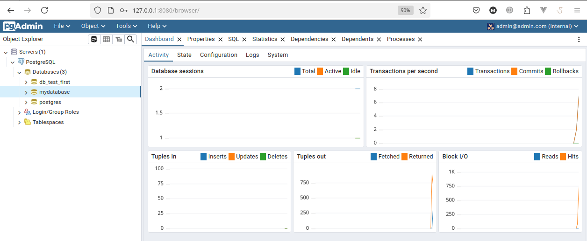
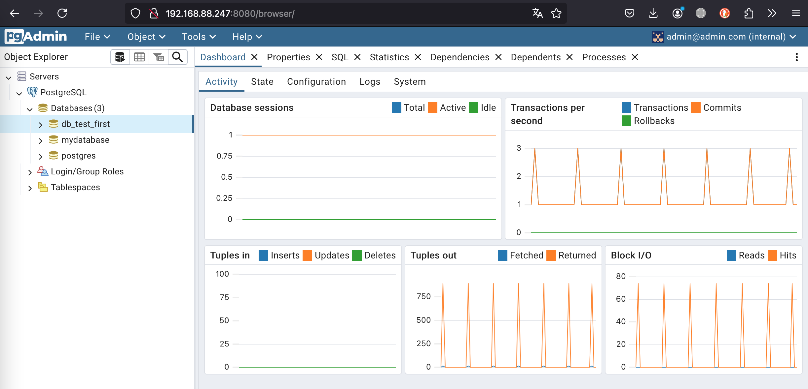
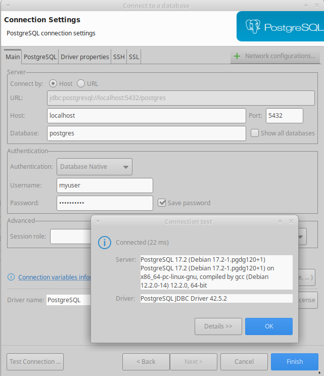
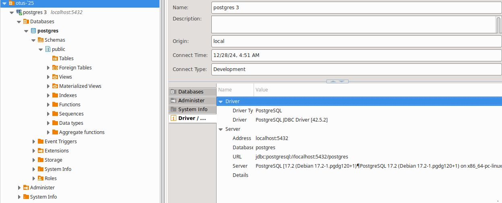
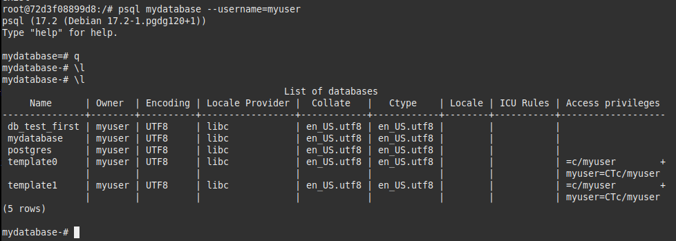

## ДЗ-03

Описание контейнера с PostgreSQL и pgAdmin в файле `docker-compose.yml`
Учетные данные описываются в файле `.env` или применяются из файла `docker-compose.yml`

Подключение к pgAdmin через браузер

На скрине видна созданная для эксперимента БД `db_test_first`

Другое подключение к pgAdmin тоже через браузер

Настройка соединения через внешнюю программу

Этот способ также успешно подключается

И проверка попытки подключения через командную строку
