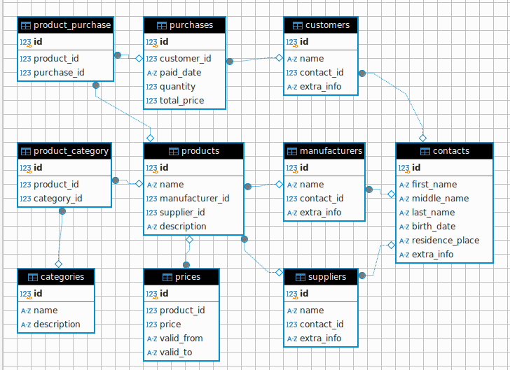

## ДЗ-01

### Схема



### Описание таблиц и полей

```sql
-- Таблица: Категории продуктов
CREATE TABLE categories (
    id INTEGER PRIMARY KEY AUTOINCREMENT,  -- Уникальный идентификатор категории
    name VARCHAR(255) NOT NULL,             -- Название категории
    description TEXT                        -- Описание категории
);

-- Таблица: Контакты
CREATE TABLE contacts (
    id INTEGER PRIMARY KEY AUTOINCREMENT,   -- Уникальный идентификатор контакта
    first_name VARCHAR(255) NOT NULL,       -- Имя контакта
    middle_name VARCHAR(255) NOT NULL,      -- Отчество контакта
    last_name VARCHAR(255) NOT NULL,        -- Фамилия контакта
    birth_date DATE NOT NULL,                -- Дата рождения контакта
    residence_place TEXT,                    -- Место жительства контакта
    extra_info TEXT                          -- Дополнительная информация о контакте
);

-- Таблица: Покупатели
CREATE TABLE customers (
    id INTEGER PRIMARY KEY AUTOINCREMENT,    -- Уникальный идентификатор покупателя
    name VARCHAR(255) NOT NULL,               -- Имя покупателя/внутренний-псевдоним
    contact_id INT REFERENCES contacts,        -- Идентификатор контакта (ссылка на таблицу contacts)
    extra_info TEXT                           -- Дополнительная информация о покупателе
);

-- Таблица: Производители
CREATE TABLE manufacturers (
    id INTEGER PRIMARY KEY AUTOINCREMENT,     -- Уникальный идентификатор производителя
    name VARCHAR(255) NOT NULL,                -- Название производителя/внутренний-псевдоним
    contact_id INT REFERENCES contacts,         -- Идентификатор контакта (ссылка на таблицу contacts)
    extra_info TEXT                            -- Дополнительная информация о производителе
);

-- Таблица: Поставщики
CREATE TABLE suppliers (
    id INTEGER PRIMARY KEY AUTOINCREMENT,      -- Уникальный идентификатор поставщика
    name VARCHAR(255) NOT NULL,                -- Название поставщика/внутренний-псевдоним
    contact_id INT REFERENCES contacts,         -- Идентификатор контакта (ссылка на таблицу contacts)
    extra_info TEXT                            -- Дополнительная информация о поставщике
);

-- Таблица: Продукты
CREATE TABLE products (
    id INTEGER PRIMARY KEY AUTOINCREMENT,      -- Уникальный идентификатор продукта
    name VARCHAR(255) NOT NULL,                -- Название продукта/внутренний-псевдоним
    category_id INT REFERENCES categories,      -- Идентификатор категории (ссылка на таблицу categories)
    manufacturer_id INT REFERENCES manufacturers, -- Идентификатор производителя (ссылка на таблицу manufacturers)
    supplier_id INT REFERENCES suppliers,       -- Идентификатор поставщика (ссылка на таблицу suppliers)
    description TEXT                           -- Описание продукта
);

-- Таблица: Цены
CREATE TABLE prices (
    id INTEGER PRIMARY KEY AUTOINCREMENT,      -- Уникальный идентификатор цены
    product_id INT REFERENCES products,         -- Идентификатор продукта (ссылка на таблицу products)
    price DECIMAL(10, 2) NOT NULL,             -- Цена продукта
    valid_from DATE,                            -- Дата начала действия цены
    valid_to DATE                              -- Дата окончания действия цены
);

-- Таблица: Покупки
CREATE TABLE purchases (
    id INTEGER PRIMARY KEY AUTOINCREMENT,       -- Уникальный идентификатор покупки
    customer_id INT REFERENCES customers,        -- Идентификатор покупателя (ссылка на таблицу customers)
    product_id INT REFERENCES products,          -- Идентификатор продукта (ссылка на таблицу products)
    paid_date DATE NOT NULL,                    -- Дата покупки
    quantity INT NOT NULL,                      -- Количество купленного продукта
    total_price DECIMAL(10, 2) NOT NULL        -- Общая стоимость покупки
);
```

### примеры бизнес-задач которые решает база
```
1. Анализ покупательского поведения

    Задача: Определить, какие продукты чаще всего покупаются вместе (например, "покупка в комплекте"). Это может помочь в создании акций и предложений, направленных на увеличение среднего чека.
    Решение: Используя данные из таблицы "Покупки", можно провести анализ частоты совместных покупок и выявить популярные комбинации продуктов.

2. Прогнозирование спроса

    Задача: Прогнозировать спрос на определенные продукты в зависимости от времени года, праздников или других факторов (например, акции, скидки).
    Решение: С помощью исторических данных о покупках можно использовать методы машинного обучения для прогнозирования будущих продаж, что поможет в планировании запасов и закупок.

3. Управление поставками и логистикой

    Задача: Оптимизировать процесс закупок и поставок, чтобы минимизировать затраты и время доставки.
    Решение: Анализируя данные о поставщиках и времени поставок, можно выявить наиболее эффективных поставщиков и оптимизировать график закупок.

4. Сегментация клиентов

    Задача: Сегментировать клиентов на основе их покупательского поведения, чтобы лучше нацеливать маркетинговые кампании.
    Решение: Используя данные о покупках и характеристиках клиентов, можно создать сегменты (например, "частые покупатели", "покупатели со скидками", "новые клиенты") и разрабатывать персонализированные предложения для каждой группы.

5. Анализ эффективности акций и скидок

    Задача: Оценить, как различные акции и скидки влияют на объем продаж и прибыль.
    Решение: Сравнивая данные о продажах до и после акций, можно определить, какие из них были наиболее успешными и какие стратегии стоит использовать в будущем.

6. Управление возвратами и рекламациями

    Задача: Анализировать причины возвратов и рекламаций, чтобы улучшить качество продуктов и обслуживания.
    Решение: Внедрение дополнительной таблицы для учета возвратов и рекламаций, что позволит отслеживать, какие продукты чаще всего возвращаются и по каким причинам.

7. Кросс-продажи и апсейлы

    Задача: Разработка стратегий кросс-продаж и апсейлов на основе анализа покупок.
    Решение: Используя данные о покупках, можно выявить, какие продукты часто покупаются вместе, и предлагать их в качестве дополнений к основным товарам.

8. Анализ ценовой эластичности

    Задача: Определить, как изменение цен на продукты влияет на объем продаж.
    Решение: Сравнивая данные о ценах и объемах продаж, можно оценить, насколько чувствительны покупатели к изменениям цен, что поможет в формировании ценовой стратегии.

9. Управление лояльностью клиентов

    Задача: Разработка программ лояльности на основе анализа покупательского поведения.
    Решение: Используя данные о частоте покупок и суммах, потраченных клиентами, можно создать программы лояльности, которые будут мотивировать клиентов совершать повторные покупки.

10. Анализ конкурентов

    Задача: Сравнить свои цены и ассортимент с конкурентами для выявления конкурентных преимуществ и недостатков.
    Решение: Сбор данных о ценах и продуктах конкурентов (например, через веб-скрейпинг) и анализ их в сравнении с собственными данными для корректировки стратегии.

Эти бизнес-задачи требуют глубокого анализа данных и могут значительно повысить эффективность бизнеса, улучшить клиентский опыт и увеличить прибыль.
```
